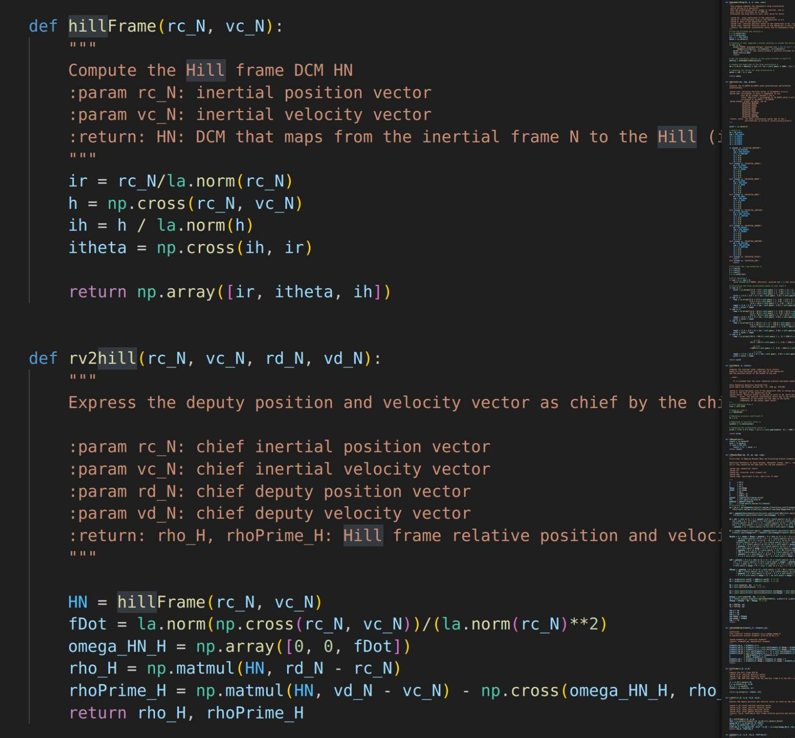
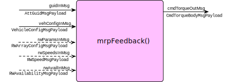
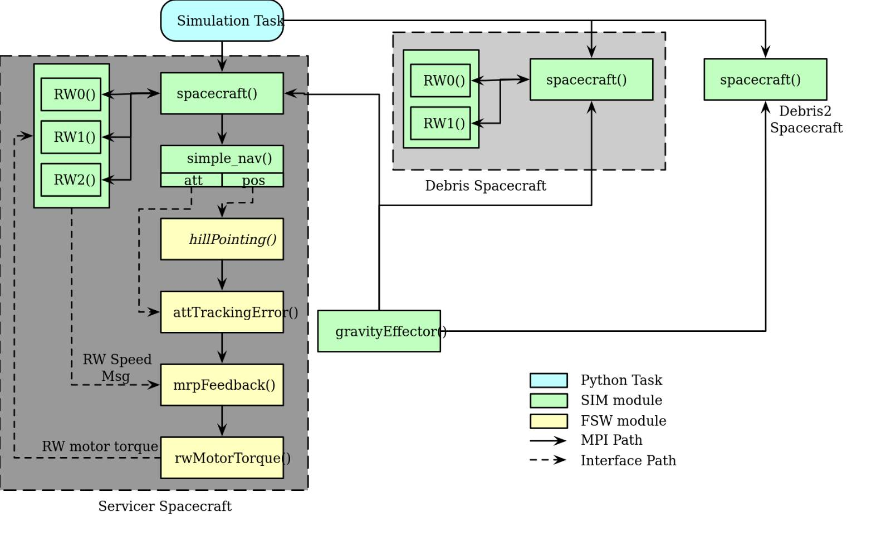

# Basilisk Thesis Notes
This repo is a direct FORK from the original [Basilisk repo](https://github.com/AVSLab/basilisk). Run `git fetch upstream` regularly to catch latest updates from the original repo. Simulations and configuration files created for this project are located inside the `dev/` file, including chosen example simulation scripts inside `dev/template-examples` copied from scripts in `examples/`.

## Run basic simulations by:
```
source .venv/bin/activate $activate python virtual env
python3 scenarioBasicOrbitStream.py $run basic simulations in terminal 
```

## Viz-support:
Viz Socket: [tcp://localhost:5556](tcp://localhost:5556)

### Loading other CAD files for visualization:
[scenarioDataToViz.py](examples/scenarioDataToViz.py) shows how (line 178 / https://hanspeterschaub.info/basilisk/Vizard/VizardGUI.html#import-a-custom-shape-model)

Example: 
```
viz = vizSupport.enableUnityVisualization(scSim, simTaskName, scList
                                                  , saveFile=fileName
                                                  , liveStream=True
                                                  )
# Enable "liveStream=True" for Viz tool to work!
# Enable "saveFile=fileName"
```

## Basilisk video takeaways:
- `scSim, Process, scObject` as SC, add the essential lines as covered in the Basic orbit case + specify moment of inertias (as Astrobee)
- Gravity factory `gravFactory` -> create Earth or other planets, map these using the line to attach Gravity model to SC (photo underlined)
- From video Basilisk: attitude feedback with RW devices: RW factory -> can specify RW spec here, see [scenarioAttitudeFeedbackRW.py](examples/scenarioAttitudeFeedbackRW.py) (probably same for thruster?); create 3 wheels with same/different initial speed and direction; seems also can map with VoltageIO, check if can related to power consumption/EPS things
- Orbital motions module [orbitalMotion.py](dist3/Basilisk/utilities/orbitalMotion.py) for state vectors r,v & rotational + attitude sigma & omega (?)
- Always use line: scSim.AddModelToTask() and add all used objects, gravity bodies, RWEffectors, etc for the the logging to work


## Useful Basilisk modules (from `Basilisk.utilities` or `Basilisk.architecture`):
- [macros.py](dist3/Basilisk/utilities/macros.py): time (e.g. day, hour, second conversions to nanosec), degree-to-radian, RPM conversions
- [RigidBodyKinematics.py](dist3/Basilisk/utilities/RigidBodyKinematics.py): EP, Gibbs vector (or Classical Rodrigues Parameters), MRP, RV, Euler angles conversions***
- [orbitalMotion.py](dist3/Basilisk/utilities/orbitalMotion.py): planetary constants, state r,v to element & vice versa, Atmospheric Drag functions (need c_D, area, mass inputs), J-Perturbations of Earth & diff. planets, Solar Radiation pressure {***Mind the units when use them, some uses km/s^2 !}, Orbital Element conversions (classicial <=> equinoctial <=> hill frame <=> RV): 
- [astroFunctions.py](dist3/Basilisk/utilities/astroFunctions.py): 
*To create thrusters/RWs:*
- [simIncludeThruster.py](dist3/Basilisk/utilities/simIncludeThruster.py) & [simIncludeRW.py](dist3/Basilisk/utilities/simIncludeRW.py), see examples in [scenarioAttitudeFeedbackRW.py line 441](examples/scenarioAttitudeFeedbackRW.py) & [scenarioFormationReconfig.py line 148](examples/scenarioFormationReconfig.py) for RWs/thrusters creation & interfacing. Also see [fswSetupThrusters.py](dist3/Basilisk/utilities/fswSetupThrusters.py) & [fswSetupRW.py](dist3/Basilisk/utilities/fswSetupRW.py) & the `messaging` module in `Basilisk.architecture` to understand the messaging and data accessing after the simulation ends -> how to get useful data (state vectors, orbits, thruster/RW performances) & visualization params out of the simulation {also check [`this messaging related module`](dist3/Basilisk/architecture/messaging/__init__.py) or [web](https://hanspeterschaub.info/basilisk/Documentation/architecture/msgPayloadDefC/index.html) for exhaustive available Basilisk messages}.
- [inertial3D.py](src/fswAlgorithms/attGuidance/inertial3D): Computes the reference attitude trajectory for a general 3D inertial pointing. A corrected body frame will align with the desired reference frame.
- [attTrackingError.py](src/fswAlgorithms/attGuidance/attTrackingError/attTrackingError.c): determines S/C attitude error/difference from the reference attitude in MRP.
- [mrpRotation.py](src/fswAlgorithms/attGuidance/mrpRotation/mrpRotation.c) or [web](https://hanspeterschaub.info/basilisk/Documentation/fswAlgorithms/attGuidance/mrpRotation/mrpRotation.html): held constant angular velocity vector constant, gives MRP input/output, may need to used with [initial3DSpin.py](https://hanspeterschaub.info/basilisk/Documentation/fswAlgorithms/attGuidance/inertial3DSpin/inertial3DSpin.html)?
- [simpleNav.py](https://hanspeterschaub.info/basilisk/Documentation/simulation/navigation/simpleNav/simpleNav.html?highlight=simplenav): navigation message (attitude sigma + position x-y-z) passing, reading from S/C states

## Useful simulation examples:
- [scenarioRendezVous.py](dev/template-examples/scenarioRendezVous.py): The script illustrates how the simulation can be run for fixed periods of time after which
some flight software modules change their input subscript to switch between the three possible
attitude pointing modes 1) Hill pointing, 2) spacecraft point at the debris object and 3) sun pointing of the solar panels.
- [scenarioFormationBasic.py](dev/template-examples/scenarioFormationBasic.py) & [web](https://hanspeterschaub.info/basilisk/examples/scenarioFormationBasic.html): Demonstrates a basic method to simulate 3 satellites with 6-DOF motion and how to visualize the simulation
data in :ref:`Vizard <vizard>`.  One satellite is a 3-axis attitude controlled
satellite, while the second satellite is a tumbling space debris object.  The controlled satellite simulation components
are taken from [scenarioAttitudeFeedbackRW.py](examples/scenarioAttitudeFeedbackRW.py). The purpose of this script is to show an explicit method to
setup multiple satellites, and also show how to store the Basilisk simulation data to be able to visualize
both satellite's motions within the :ref:`Vizard <vizard>` application. Note, this scenario also illustrates how to ensure that the differential equations of motion of
the servicer and debris object are integrated at the same time.  This is not required in this scenario
as there are no direct satellite-to-satellite dynamic interactions.; ALSO see line 248 which sync the integration of both S/Cs + demo of changing integrator from default RK4.
- [scenarioHohmann.py](dev/template-examples/scenarioHohmann.py): Hohnmann transfer for delta-V examples & Hill-pointing
- [scenarioAttLocPoint.py](examples/scenarioAttLocPoint.py): Ground location / Ground station creation + Vizard visualisation style (`stationName` & ground location vector `r_GP_P`).
- [scenarioFormationReconfig.py](examples/scenarioFormationReconfig.py) & [spacecraftReconfig.c](src/fswAlgorithms/formationFlying/spacecraftReconfig/spacecraftReconfig.c) & [web](https://hanspeterschaub.info/basilisk/Documentation/fswAlgorithms/formationFlying/spacecraftReconfig/spacecraftReconfig.html): formation flight spacecraft reconfiguring module (bang-bang controller?) with potetial useful references on messaging. (also see [web for formationBarycenter](https://hanspeterschaub.info/basilisk/Documentation/fswAlgorithms/formationFlying/formationBarycenter/formationBarycenter.html), determinethe barycenter of a swarm of satellites)

## Making Python Modules:
- NEW: see [scenarioAttitudePointingPy.py](examples/scenarioAttitudePointingPy.py) line 286 for `PythonMRPPD` implementations
- See [making-pyModules.py](docs/source/codeSamples/making-pyModules.py) & [this url](https://hanspeterschaub.info/basilisk/Learn/makingModules/pyModules.html) for basic Python module creation, should be useful for creating a new controller! 
- Also see how the [mrpFeedback.py](dist3/Basilisk/fswAlgorithms/mrpFeedback.py) for controller module demo ( & if necessary [mrpFeedback.c](src/fswAlgorithms/attControl/mrpFeedback/mrpFeedback.c) for actual control laws)  (`mrpSteering` module is not useful as it relates to servo control) ; 
- Flow chart from [scenarioFormationBasic from Basilisk web](https://hanspeterschaub.info/basilisk/examples/scenarioFormationBasic.html): 
- Message `rwMotorTorque`: see [web](https://hanspeterschaub.info/basilisk/Documentation/fswAlgorithms/effectorInterfaces/rwMotorTorque/rwMotorTorque.html?highlight=rwmotortorque)to map RW thrust, relates with the above flow chart; check this [link](https://hanspeterschaub.info/basilisk/Documentation/fswAlgorithms/effectorInterfaces/index.html) as well.